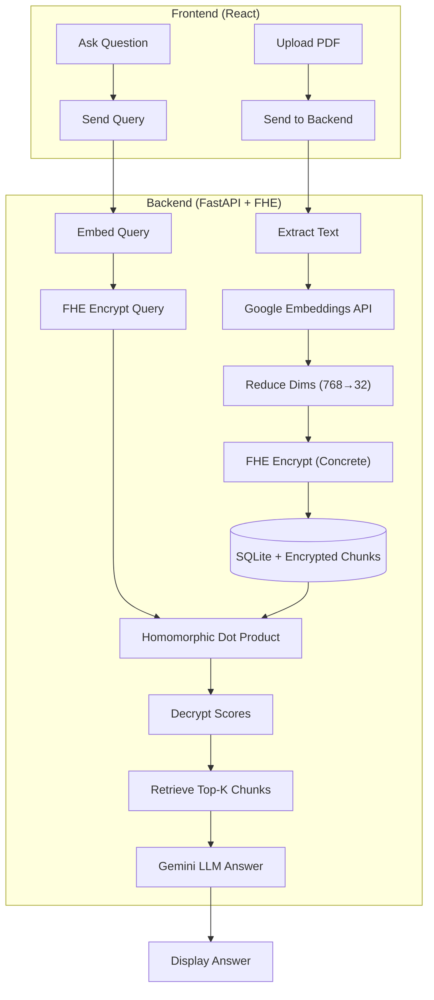

# PDF-Chat with FHE-RAG

A privacy-preserving PDF chat application using **Fully Homomorphic Encryption (FHE)** for secure similarity search. Chat with your documents without exposing your data!

## 🔐 Privacy-First Architecture



## 🛠️ Tech Stack

| Layer | Technology |
|-------|------------|
| **Frontend** | React 19, TypeScript, Vite, Tailwind |
| **Backend** | FastAPI, SQLAlchemy, PyMuPDF |
| **FHE** | Concrete-Python (TFHE-rs) |
| **Embeddings** | Google Gemini (`gemini-embedding-001`) |
| **LLM** | Google Gemini Flash |

## 📋 Prerequisites

- **Python 3.11** (required for Concrete-Python)
- **Node.js 18+** / **pnpm**
- **Google AI API Key**
- **Linux or macOS** (FHE library requirement)

## 🚀 Quick Start

### 1. Clone & Setup Backend

```bash
git clone https://github.com/thornxyz/pdf-chat.git
cd pdf-chat/backend

# Set Python version and install dependencies
uv python pin 3.11
uv sync
```

### 2. Environment Configuration

Create `backend/.env`:

```env
GOOGLE_API_KEY=your_google_ai_api_key_here
SECRET_KEY=your_generated_jwt_secret_key
ALGORITHM=HS256
ACCESS_TOKEN_EXPIRE_MINUTES=30
```

### 3. Frontend Setup

```bash
cd frontend
pnpm install
```

### 4. Run the Application

**Terminal 1 - Backend:**
```bash
cd backend && uv run main.py
```

**Terminal 2 - Frontend:**
```bash
cd frontend && pnpm dev
```

### 5. Access

- **App**: http://localhost:5173
- **API Docs**: http://localhost:8000/docs

## 🔒 FHE Details

| Property | Value |
|----------|-------|
| **Scheme** | TFHE (via Concrete-Python) |
| **Embedding Reduction** | 768 → 32 dimensions |
| **Quantization** | 4-bit integers |
| **Ciphertext Size** | ~1 MB per chunk |
| **First Query** | ~10s (circuit compilation) |
| **Subsequent Queries** | ~100-500ms per similarity |

### Verify FHE is Working

```bash
cd backend && uv run python -c "
import fhe_service
ctx = fhe_service.FHEContext()
enc = ctx.encrypt_vector([0.1] * 768)
print(f'Encrypted size: {len(enc):,} bytes')  # Should be ~1MB
"
```

## 📝 API Endpoints

### Authentication
- `POST /auth/register` - Register user
- `POST /auth/token` - Login
- `GET /auth/me` - Current user

### FHE Keys
- `POST /fhe/generate-keys` - Generate keypair
- `POST /fhe/upload-key` - Store public key

### Documents
- `POST /upload/` - Upload PDF (encrypts embeddings)
- `GET /documents/` - List PDFs
- `DELETE /documents/{name}` - Delete PDF

### Chat
- `POST /ask/` - Query PDF (FHE similarity search)
- `GET /chat-history/{name}` - Chat history

## 📁 Project Structure

```
pdf-chat/
├── backend/
│   ├── api.py              # FastAPI endpoints
│   ├── fhe_service.py      # Concrete-Python FHE
│   ├── embedding_service.py # Google embeddings
│   ├── database.py         # SQLAlchemy ORM
│   └── models.py           # DB schemas
├── frontend/
│   ├── src/
│   │   ├── components/     # React components
│   │   ├── lib/api.ts      # API client
│   │   └── contexts/       # Auth & PDF context
│   └── package.json
└── data/
    ├── database.db         # SQLite
    └── fhe/keys/           # Cached FHE keys
```

## ⚠️ Notes

- **First request is slow** (~10s) due to FHE circuit compilation
- **Keys are cached** in `data/fhe/keys/` for faster restarts
- **Windows**: Use WSL for Concrete-Python compatibility
