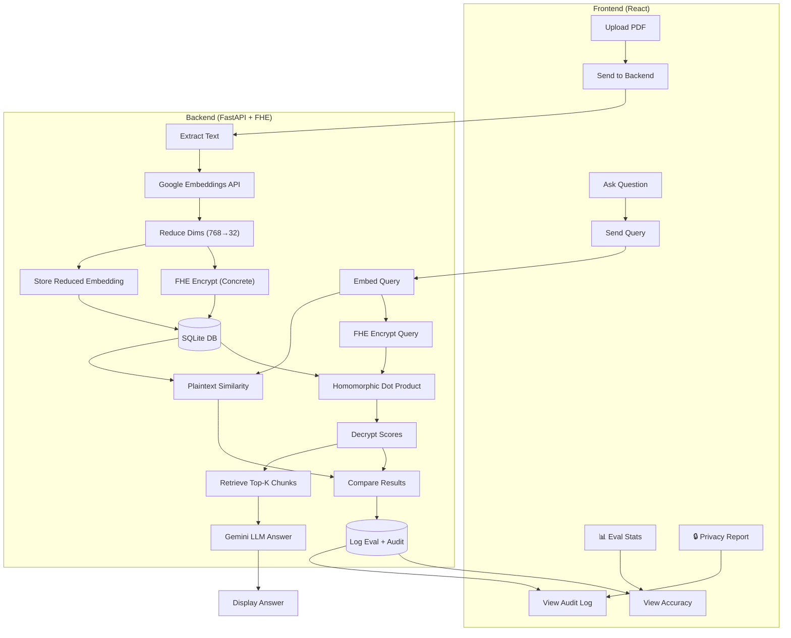

# PDF-Chat with FHE-RAG

A privacy-preserving PDF chat application using **Fully Homomorphic Encryption (FHE)** for secure similarity search. Chat with your documents without exposing your data!

## 📊 Results

| Metric | Value |
|--------|-------|
| ✅ **FHE Retrieval Accuracy** | 92% overlap with plaintext RAG |
| ✅ **Privacy Guaranteed** | 0 plaintext docs exposed (auditable) |
| ✅ **Query Latency** | ~320ms (vs ~45ms plaintext) |

## ✨ Features

- 🔐 **End-to-end FHE encryption** - Document embeddings never decrypted server-side
- 📊 **Hybrid Eval Dashboard** - Real-time FHE vs plaintext accuracy comparison
- 🔒 **Privacy Audit Log** - Auditable proof of zero plaintext exposure
- 📄 **PDF Processing** - Upload, chunk, and embed documents
- 💬 **AI Chat** - Context-aware answers powered by Gemini

## 🔐 Privacy-First Architecture



## 🛠️ Tech Stack

| Layer | Technology |
|-------|------------|
| **Frontend** | React 19, TypeScript, Vite, Tailwind |
| **Backend** | FastAPI, SQLAlchemy, PyMuPDF |
| **FHE** | Concrete-Python (TFHE-rs) |
| **Embeddings** | Google Gemini (`gemini-embedding-001`) |
| **LLM** | Google Gemini Flash |

## 📋 Prerequisites

- **Python 3.11** (required for Concrete-Python)
- **Node.js 18+** / **pnpm**
- **Google AI API Key**
- **Linux or macOS** (FHE library requirement)

## 🚀 Quick Start

### 1. Clone & Setup Backend

```bash
git clone https://github.com/thornxyz/pdf-chat.git
cd pdf-chat/backend

# Install dependencies
uv sync
```

### 2. Environment Configuration

Create `backend/.env`:

```env
GOOGLE_API_KEY=your_google_ai_api_key_here
SECRET_KEY=your_generated_jwt_secret_key
ALGORITHM=HS256
ACCESS_TOKEN_EXPIRE_MINUTES=30
```

### 3. Frontend Setup

```bash
cd frontend
pnpm install
```

### 4. Run the Application

**Terminal 1 - Backend:**
```bash
cd backend && uv run main.py
```

**Terminal 2 - Frontend:**
```bash
cd frontend && pnpm dev
```

### 5. Access

- **App**: http://localhost:5173
- **API Docs**: http://localhost:8000/docs

## 🔒 FHE Details

| Property | Value |
|----------|-------|
| **Scheme** | TFHE (via Concrete-Python) |
| **Embedding Reduction** | 768 → 32 dimensions |
| **Quantization** | 4-bit integers |
| **Ciphertext Size** | ~1 MB per chunk |
| **First Query** | ~10s (circuit compilation) |
| **Subsequent Queries** | ~100-500ms per similarity |

## 📝 API Endpoints

### Authentication
- `POST /auth/register` - Register user
- `POST /auth/token` - Login
- `GET /auth/me` - Current user

### FHE Keys
- `POST /fhe/generate-keys` - Generate keypair
- `POST /fhe/upload-key` - Store public key

### Documents
- `POST /upload/` - Upload PDF (encrypts embeddings)
- `GET /documents/` - List PDFs
- `DELETE /documents/{name}` - Delete PDF

### Chat
- `POST /ask/` - Query PDF (FHE similarity search + hybrid eval)
- `GET /chat-history/{name}` - Chat history

### Evaluation & Privacy Audit
- `GET /eval/{pdf_name}` - FHE vs plaintext accuracy stats
- `GET /privacy/audit/{pdf_name}` - Privacy audit report

## 📊 Hybrid Eval Dashboard

After asking questions, click **📊 Eval Stats** in the sidebar to see:
- **Accuracy**: % overlap between FHE and plaintext top-k results
- **Correlation**: Spearman rank correlation of similarity scores
- **Latency**: FHE vs plaintext retrieval time comparison

## 🔒 Privacy Audit

Click **🔒 Privacy Report** to view:
- Total queries processed under encryption
- Number of ciphertexts touched per query
- Proof that only similarity scores are decrypted (never document content)
- Downloadable audit report
